<h1>How to install GitLab in AWS EC2</h1>

1. <h4> Go to aws marketplace : </h4>

> <https://aws.amazon.com/marketplace/pp/prodview-5prv743vhumzm?sr=0-1&ref_=beagle&applicationId=AWSMPContessa>

2. <h4> click on the 'Continue to Subscribe'</h4>

> 

3. <h4>click on the 'Continue to Configuration'</h4>

> 

4. <h4>Click on the 'Continue to Launch'</h4>

> 

5. <h4>For action there 2 options</h4>

<li>Launch from Website (recommended)</li>
<li>Launch through EC2 </li>

> 

6. <h4>Make sure u click the "Create New Based On Seller Settings" if not there will be some issues when hosting the gitlab (p.s: based on my current knowledge) </h4>

> 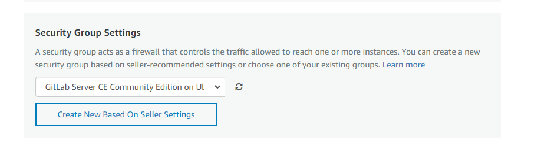

<h4> leaving the source IP to anywhere is not a best practice but for practice purpose it can be done </h4>

> 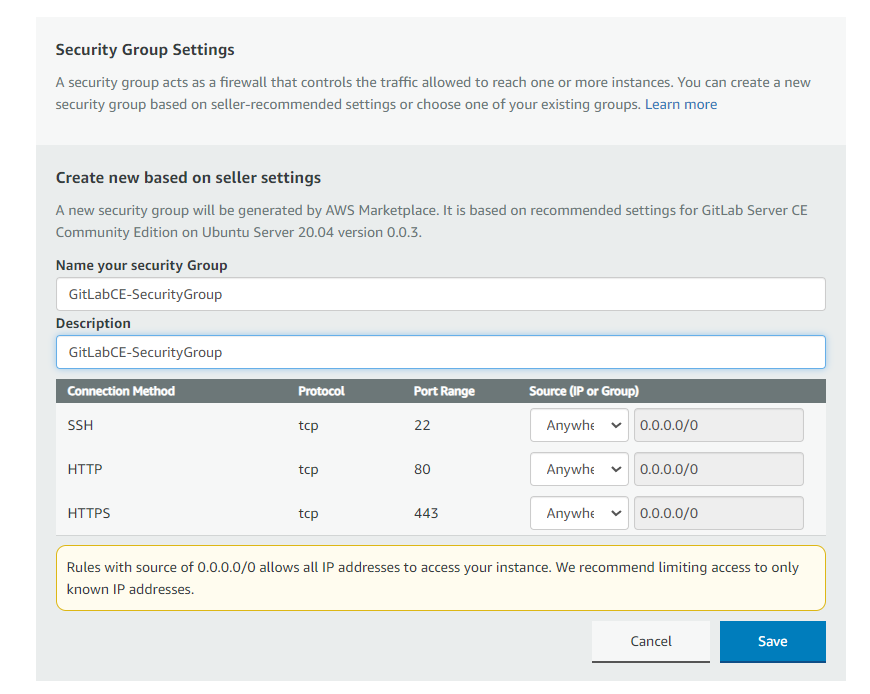

<li> Then click save </li>

7. <h4>Select your key pair if don't have one checkout this <a href ='https://youtu.be/0Gz-PUnEUF0?si=oLEpVGrPryO18BHc&t=247'>link</a> how to create a key Pair</h4>

> 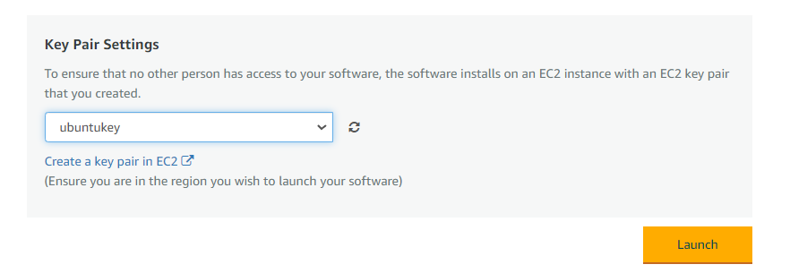

<li> Then click Launch</li>

8. <h4>After the instance created you will get message like this. Click on the "EC2 Console" to go to the EC2 Console</h4>

> 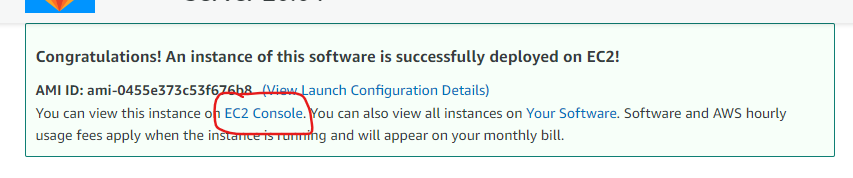

9. <h4>This is the instance we create just now. You can rename it by clicking the pencil button on the name column</h4>

> 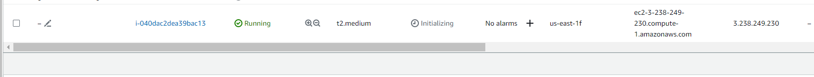

10. <h4>To connect to the instance we have to click on the checkbox on the left and click the connect button on the top<h4>

> 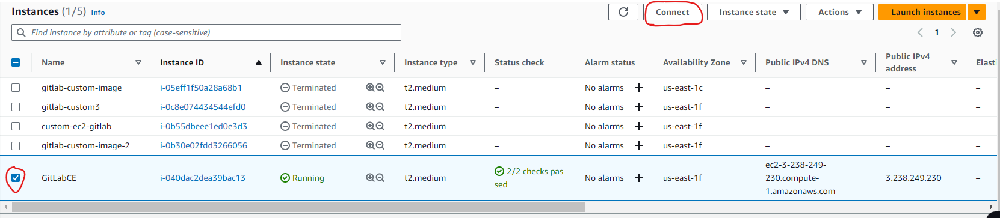

11. <h4>Click on the copy button to copy the command to ssh from our machine.</h4>

> 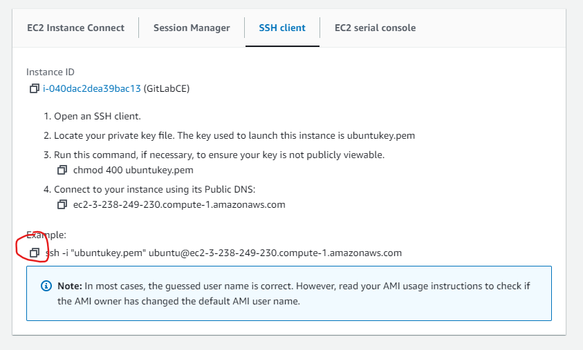

12. <h4>Paste the command on the location where you saved your .pem file</h4>

```
sudo ssh -i <example.pem> <hostname@public-ip>
```

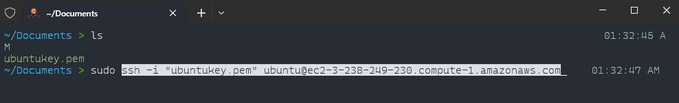

13. <h4>After successfully ssh, key in the below command to access the gitlab configuration file.</h4>

```
sudo nano /etc/gitlab/gitlab.rb
```

14. <h4>Locate to the 'external-url' line change the 'http://gitlab.example.com' to your instance's public ip. Then save and exit the file </h4>

<li>Before</li>

> 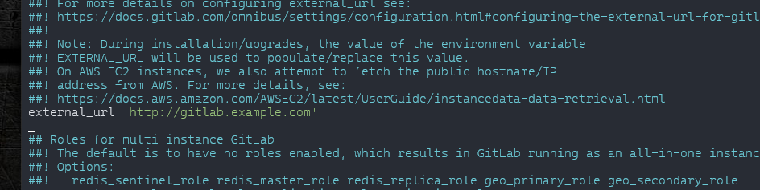

<li>After</li>

> 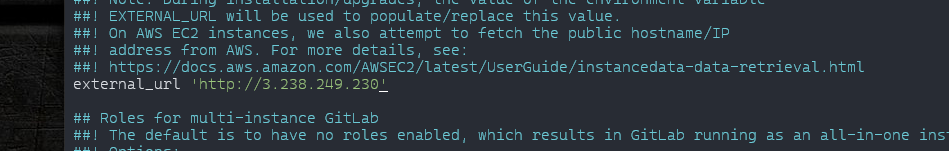

15. <h4>Then run the following command to reconfigure gitlab using command below </h4>

```
sudo gitlab-ctl reconfigure
```

16. <h4> The you can copy paste your public ip of your instance in the browser to access gitlab</h4>
> 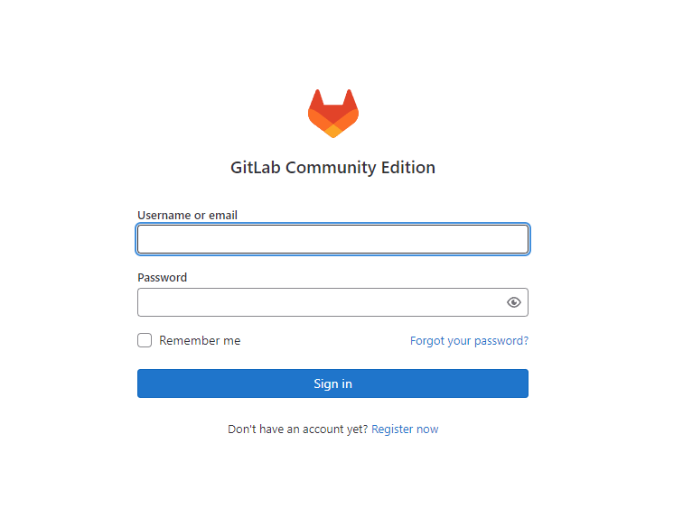

17. <h4>To reset root password run the command below and enter a new password</h4>

```
sudo gitlab-rake 'gitlab:password:reset[root]'
```

18. <h4>Your username will be root and the password will be the password that you set</h4>

> 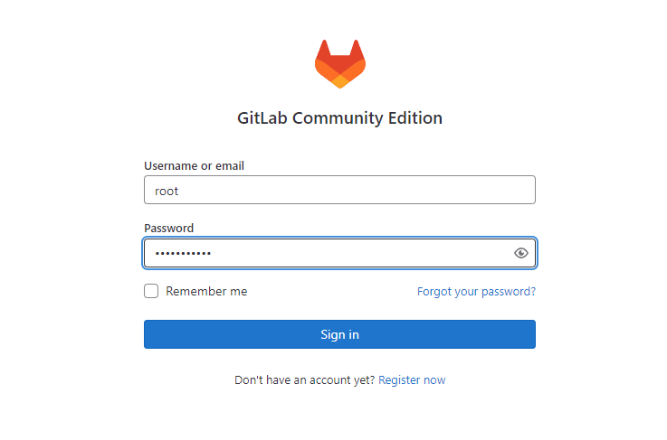

<h1>Additional resources</h1>

<ul>
<li><a href ='https://youtu.be/LCyTCoZ2YoI?si=yFgd5qWd1QiMhJFk'>How to Setup\Install GitLab on Ubuntu in AWS (Self Hosted CI\CD Platform)</a></li>
<li><a href ='https://youtu.be/0Gz-PUnEUF0?si=wezF9Gan2fDP08Ib'>How to Create an EC2 Instance in AWS in 2023</a></li>

<li><a href ='https://cloudinfrastructureservices.co.uk/how-to-setup-gitlab-ce-server-on-azure-aws-gcp/'>How to Setup GitLab CE Server Linux on Azure/AWS/GCP
</a></li>
</ul>

